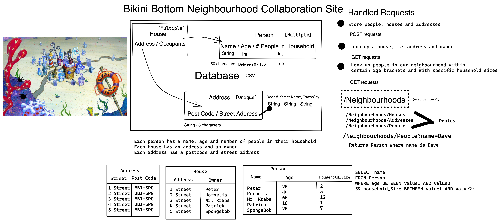

# NeighbourhoodAPI
Documentation for Neighbourhood API

The Neighbourhood API is organised around REST.
Our API has predictable resource-oriented URLs, accepts form-encoded request bodies, returns JSON-encoded responses, and uses standard HTTP response codes, and verbs.

## BASE URL
 https://api.neighbourhood.com
## Installation
1. Clone or fork repo.
2. Run `npm install` to install node packages.
## Authentication 
This API does not require API keys. 
## Technologies
- JavaScript
- HTML
- CSS
- Node:
    - jest
- Heroku
- Netlify
## ERRORS
Our API uses conventional HTTP response codes to indicate the success or failure of an API request. In general: Codes in the 2xx range indicate success. Codes in the 4xx range indicate an error that failed given the information provided (e.g., a required parameter was omitted, a charge failed, etc.). Codes in the 5xx range indicate an error with our's servers.
## PATHS
https://api.neighbourhood.com/houses <- house collection
https://api.neighbourhood.com/people <- person collection
https://api.neighbourhood.com/addresses <- address collection 

